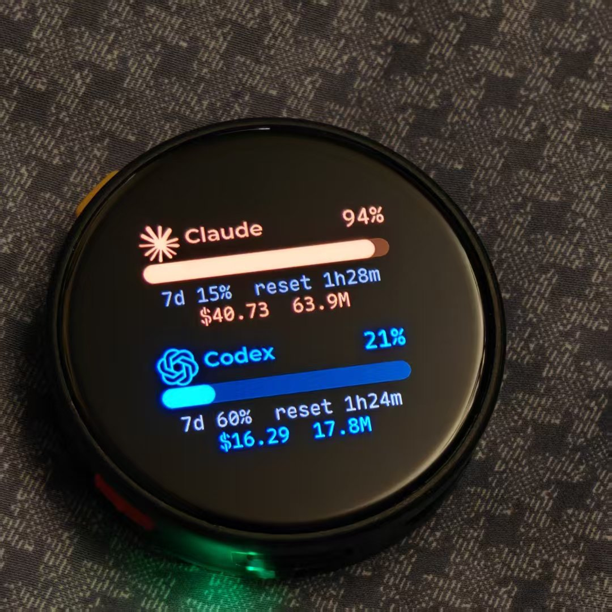
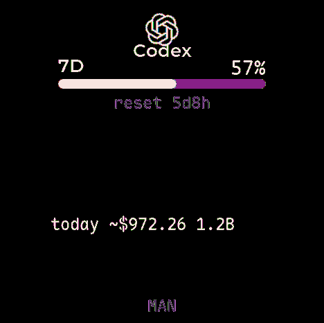

# CC Island（中文说明）

<p align="center">
  <a href="README.md">English</a> | 简体中文
</p>

> 把 AI 编程用量和主机状态，搬到你的 M5Stack StopWatch 手表上。

<p align="center">
  
</p>

<p align="center">
  
  
</p>

左边是第一版经典双行布局的真机照片；右边是当前 Codex 独立页面，由手表帧缓冲直接抓取。

CC Island 把一块 **M5Stack StopWatch**（圆形 AMOLED，ESP32‑S3）变成 AI
编程用量与主机健康状态的小表盘。它支持 **Claude Code（橙）**、**Codex（蓝）**、
**OpenCode（紫）**，显示滚动窗口、重置倒计时、本地 token、API 等效价值与 PC 状态。

支持的 provider 与传输方式：
- **Claude Code / Codex / OpenCode** 三个 provider，可选经典双行布局，也可让
  Codex 与 OpenCode 各自独占一页
- **蓝牙 BLE** 与 **Wi‑Fi HTTP 轮询**两种传输，可并存
- **主机系统页**：电脑名、CPU、内存、磁盘占用与读写、网络上下行；支持自动轮播和左右滑动

灵感来自 [CodexIsland](https://github.com/ericjypark/codex-island)（显示在 MacBook 刘海里）。
**本地优先，provider 凭证始终留在主机**：bridge 读取你 CLI 已经写好的凭证、查询各家官方用量接口、
从本地会话日志计算统计，再把最终数字通过**蓝牙 BLE** 或 **Wi‑Fi HTTP** 传给手表。

## 项目沿革

这个持续维护的 fork 基于
[alexjc-tech/cc-island](https://github.com/alexjc-tech/cc-island)。固件底座来自 M5Stack
的 [M5StopWatch-UserDemo](https://github.com/m5stack/M5StopWatch-UserDemo)；AI 用量伴侣的
产品思路和最初的 provider 鉴权方案则改编自 Eric Park 的
[CodexIsland](https://github.com/ericjypark/codex-island)。三者分别代表直接上游、固件底座和
产品灵感，因此在这里明确区分。

## 先选使用方式

| 目标 | 传输 | `.env` | 主机支持 |
| --- | --- | --- | --- |
| 只看 AI 用量 | Wi‑Fi | `CC_SYSTEM_MONITOR=false` | Windows、macOS、Linux、WSL |
| AI 用量 + 主机监控 | Wi‑Fi | `CC_SYSTEM_MONITOR=true` | Windows、macOS、Linux、WSL |
| 低频推送 | BLE（`bleak`） | 均可 | Windows、macOS、Linux |

功能最完整的组合是 `CC_LAYOUT=pages` + Wi‑Fi polling，再按需开启系统页；偏好原版
高密度界面则使用 `rows`。同一份固件也可以同时保留 BLE 与 Wi‑Fi。

### 三平台支持矩阵

| 能力 | Windows | macOS | Linux |
| --- | --- | --- | --- |
| Codex 登录与本地日志 | `~/.codex` | `~/.codex` | `~/.codex` |
| Claude 登录与本地日志 | `~/.claude/.credentials.json` | Keychain，再回退凭证文件 | `~/.claude/.credentials.json` |
| OpenCode 本地用量 | XDG data / `opencode.db` | XDG data / `opencode.db` | XDG data / `opencode.db` |
| 主机指标 | `psutil`，PowerShell 兜底 | `psutil`，原生命令兜底 | `psutil`，`/proc` 兜底 |
| Wi‑Fi polling | 支持 | 支持 | 支持 |
| BLE push | 支持 | 支持 | 支持（需要 BlueZ） |

Bridge 运行在 WSL 时，还会自动检查挂载进来的 Windows 用户目录，因此 OpenCode
安装在 Windows 上也能读取。自定义目录可以通过 `CODEX_HOME`、
`CLAUDE_CONFIG_DIR`、`OPENCODE_DB` 明确指定。

## 显示内容

内置两种显示布局：

- **`rows`**：经典紧凑布局，从 Claude Code、Codex、OpenCode 中任选两个放在同一页
- **`pages`**：Codex 一页、OpenCode 一页，并可加入系统页；有空间完整显示各窗口
  的重置时间和 OpenCode 月度配额

运行 `scripts/install_firmware.sh` 前设置 `CC_LAYOUT=rows|pages`。系统监控默认关闭；
设置 `CC_SYSTEM_MONITOR=true` 后才会采集主机指标并加入系统页。两种布局均可显示：

- provider **用量窗口**：百分比、品牌色进度条、重置倒计时
- **今日 token 数**与 **API 等效价值**
- 5 小时用量首次超过 80% 时**振动提醒**
- OpenCode 配置 Go auth cookie 后显示**真实配额**（5 小时 / 每周 / 每月及重置）；
  未配置时显示本地今日 / 7 天用量

界面以 `~$` 开头的金额表示 **API 等效价值**，不是实际账单。Claude、Codex 与能够
识别模型的 OpenCode 都使用 OpenRouter 当前公开价格目录折算；未知 OpenCode 模型才
回退它自己记录的金额。使用 Coding Plan、OpenCode Go 或其他订阅时，不会按这个金额
重复扣费。

可选的**系统页**显示 bridge 主机的电脑名、CPU、内存、磁盘占用与读写速率、网络
上下行。运行在 WSL 时优先通过 PowerShell 读取 Windows 主机，互操作不可用时才回退
到 WSL 虚拟机。原生 Windows、macOS 与 Linux 使用 `psutil`，并分别保留 PowerShell、
原生命令和 `/proc` 兜底。系统监控仍默认关闭，因为它和 AI 用量是独立功能。

左右滑动可切页；**橙色按钮**切换 `AUTO` / `MAN` 自动或手动轮播；**蓝色按钮**
请求立即刷新。设置 `CC_AUTO_SWITCH_MS=0` 可让固件默认从手动模式启动。

## 架构

```
  Windows / macOS / Linux（大脑）                手表 / CC Island app（脸）
  bridge/codexisland_bridge.py                   firmware/app_codex
   · Claude/Codex 接口 + 本地日志                  · 双行或 provider 独立页面（LVGL）
   · OpenCode SQLite + 可选 Go 配额                · 滑动 + 自动/手动轮播
   · 三平台原生指标 + WSL Windows 集成               · 可选主机系统页
   · provider 缓存 30 秒 / 系统约 4 秒             · Wi-Fi polling + BLE NUS 接收
   · GET /stats ─────────HTTP (Wi‑Fi)─────────▶   · 蓝键立即刷新
   · 紧凑 JSON 推送 ───蓝牙(NUS)──────────────▶   · 过阈值振动
```

手表是被动的 BLE 外设（Mac/PC 连上写入），也可连 Wi‑Fi 定时轮询。**token、日志、
API 凭证和 Cookie 都不会传到手表**，只传算好的数字。

## 快速开始

**1. 刷固件**（需要 [ESP‑IDF v5.5.4](https://docs.espressif.com/projects/esp-idf/en/v5.5.4/esp32s3/index.html)）

`.env` 同时包含需要编进手表的配置，以及只由 bridge 运行时读取的配置：

| 配置 | 谁读取 | 要重新刷表？ | 要重启 bridge？ |
| --- | --- | --- | --- |
| `CC_WIFI_*`、`CC_BRIDGE_*`、`CC_POLL_MS` | 固件安装脚本 | 要 | 不要 |
| `CC_LAYOUT`、`CC_AUTO_SWITCH_MS` | 固件安装脚本 | 要 | 不要 |
| `CC_SYSTEM_MONITOR` | 固件安装脚本 + bridge | 要 | 要 |
| `OPENCODE_GO_*`、`OPENCODE_DB` | bridge | 不要 | 要 |
| `CODEX_HOME`、`CLAUDE_CONFIG_DIR` | bridge | 不要 | 要 |
| `CC_PRICING_*`、`CC_CODEX_FALLBACK_MODEL` | bridge | 不要 | 要 |

provider 密钥不会写入固件。Codex、Claude 复用 bridge 主机已有的 CLI 登录凭证；
OpenCode 本地统计只读查询它的 SQLite 数据库。

```bash
cp .env.example .env                # 本地配置与敏感信息，已被 Git 忽略，绝对不要提交
# 编辑 Wi-Fi、bridge 地址、布局、刷新间隔、可选系统监控和 OpenCode Go 配置
./scripts/install_firmware.sh          # clone 出厂固件并集成 app（到 ./build-firmware）
. ~/esp/esp-idf/export.sh
cd build-firmware && idf.py build && idf.py -p /dev/cu.usbmodemXXXX flash
```
`install_firmware.sh` 只把 `CC_*` 配置写进同样被忽略的 `build-firmware/`；Git 跟踪
的源码只保留占位值。Wi-Fi 名称和密码会随固件写入手表；provider API 凭证与
OpenCode Cookie 始终留在 bridge 主机。刷完后在表上**打开一次 CC Island app**以启动传输。

**2. 跑 bridge（两种模式，任选其一）**

先安装一次 [uv](https://docs.astral.sh/uv/getting-started/installation/)，再创建锁定的
运行环境。Windows PowerShell、macOS、Linux 使用相同命令：

```console
uv sync
```

Wi‑Fi 模式三平台均推荐：

```console
uv run python bridge/codexisland_bridge.py --serve 8080
```

bridge 会自动读取 `.env`。OpenCode 本地用量无需额外配置；可选的 `OPENCODE_GO_*`
用于启用真实 Go 配额。`CC_SYSTEM_MONITOR=true` 会同时开启主机指标采集和固件系统页；
修改后需重新运行安装脚本、编译并刷入固件。浏览器可访问 `/` 看文本、`/json` 看完整
数据、`/stats` 看手表载荷。

蓝牙模式（通过 `bleak` 支持 Windows / macOS / Linux）：

```console
uv run python bridge/codexisland_bridge.py --ble 5
```

macOS 首次运行会弹蓝牙权限；Linux 需要可用的 BlueZ/D-Bus。仓库自带的登录自启脚本
目前只负责 macOS：`./scripts/setup_autostart.sh`。使用 `--json` 或不带参数可只检查数据。

## 使用

- **自动刷新（Wi‑Fi）**：源码模板默认 10 秒，`.env.example` 使用 5 秒；provider 数据
  缓存 30 秒；开启后系统指标约 4 秒刷新，所以手表 5 秒 polling 不会每次都请求 provider
- **自动刷新（BLE）**：每 N 分钟（默认 5；Anthropic 接口会限流，别低于几分钟）。
- **切换页面**：左右滑动；源码兜底值是每 5 秒自动轮播，**橙键**切换 `AUTO`
  （按定时器轮播）/ `MAN`（停留在当前页，直到手动滑动）；
  `.env.example` 设置了 `CC_AUTO_SWITCH_MS=0`，所以按示例生成的固件默认是手动模式
- **手动刷新**：按**蓝键**，手表振动并请求立即刷新（5 秒防抖）。
- **退出 app**：同时长按**两个按钮**（出厂固件的“回主页”）。

## 自定义

- **本地配置** — 复制 `.env.example` 为 `.env`；`CC_WIFI_*`、`CC_BRIDGE_*`、
  `CC_POLL_MS` 控制 Wi-Fi，`CC_LAYOUT=rows|pages` 与 `CC_AUTO_SWITCH_MS` 控制页面，
  `CC_SYSTEM_MONITOR=true|false` 同时控制系统指标采集和系统页。`.env` 与
  `build-firmware/` 都不会进入 Git
- **双行 provider / 系统页** — `firmware/app_codex/app_codex_config.h` 中的
  `kTopProvider` / `kBottomProvider`（`"c"` Claude / `"x"` Codex / `"o"`
  OpenCode）和 `kShowSystemPage`；独立页面布局目前固定生成 Codex、OpenCode 页
- **Wi-Fi 默认模板** — `firmware/app_codex/net/net_config.h`
- **配色 / 告警阈值** — `firmware/app_codex/app_codex.cpp`
  （`kClaudeColor` / `kCodexColor` / `kOpencodeColor` / `kAlertThreshold`）
- **Go 配额配置** — 环境变量 `OPENCODE_GO_WORKSPACE_ID` / `OPENCODE_GO_AUTH_COOKIE`
- **真机帧缓冲截图** — USB 连接后运行：

  ```console
  uv run --with pyserial --with pillow python tools/screenshot.py out.png --port /dev/ttyACM0
  ```

  开发调试时加 `--advance 1`（或 `-1`）可在截图前切换页面
- **启动图标 / provider Logo** — `firmware/tools/cc_island.svg` 是 CC Island
  自己的三色监控图标；其他 SVG 只用于标识 provider。运行下面命令可重新生成固件位图：
  ```bash
  uv run --with svglib --with pillow --with reportlab --with rlpycairo \
    python firmware/tools/gen_icons.py
  ```
- **动态定价** — bridge 每 6 小时刷新 OpenRouter 公开的
  [`/api/v1/models`](https://openrouter.ai/api/v1/models)，并保留磁盘 last-good 缓存和
  小型离线兜底表。可用 `CC_PRICING_REFRESH_HOURS`、`CC_PRICING_CACHE` 覆盖默认值；
  `CC_CODEX_FALLBACK_MODEL` 决定隐藏模型 `codex-auto-review` 的等效计价，默认
  `gpt-5.6-sol`。OpenCode 的订阅/router provider ID 与模型发布者不一致时，会在结果
  唯一的前提下按公开模型名匹配

## 数据来源与金额口径

- **Codex**：使用 `CODEX_HOME/auth.json`（默认 `~/.codex/auth.json`）中的 access
  token 读取用量窗口，并解析 session JSONL 统计今天的 token；WSL 还会自动检查
  Windows 用户目录
- **Claude Code**：复用 `CLAUDE_CODE_OAUTH_TOKEN`、macOS Keychain 或
  `CLAUDE_CONFIG_DIR/.credentials.json`（默认 `~/.claude/.credentials.json`）读取官方
  用量接口；今天的 token 来自各平台 `~/.claude/projects/**/*.jsonl`
- **OpenCode**：只读查询官方 XDG data 目录，三平台通常都是
  `~/.local/share/opencode/opencode.db`，也会识别 beta/dev channel 数据库；可用
  `OPENCODE_DB` 或 `--db` 覆盖。Bridge 按 assistant message 的发生时间汇总各类 token，
  跨日继续旧 session 也不会漏算，并按时间、provider、模型与 token 指纹去除重复的
  subagent 调用。已识别模型按 OpenRouter 折算等效价值，即使 Coding Plan 记录金额为 0
  也能显示；未知模型和旧数据库结构才回退 OpenCode 的记录金额。`/json` 仍以
  `actual_t` / `actual_d` 保留记录金额供诊断。配置 `OPENCODE_GO_*` 后才会额外读取 Go
  订阅窗口，并缓存 5 分钟
- **系统指标（可选）**：仅在 `CC_SYSTEM_MONITOR=true` 时采集；原生 Windows、macOS、
  Linux 使用 `psutil`，并有平台原生兜底。WSL 优先通过 PowerShell 读取 Windows 主机，
  失败后才显示 WSL 自身。关闭时 Bridge 不采集，也不会在 payload 中发送 `sys`
- **`~$` 等效价值**：Claude、Codex 与已识别的 OpenCode 模型按 OpenRouter 动态目录
  估算，不是 Coding Plan
  或订阅账单；bridge 只下载公开价格目录，不会上送本地凭证、prompt 或 usage。先精确
  匹配模型，再处理日期/provider 别名与离线兜底；仍未识别的模型继续计入 token，并在
  `/json` 的 pricing diagnostics 中列出，OpenCode 同时保留记录金额作为兜底。token
  总量分别计入非缓存 input、cached input、cache write 与 output 各一次；Codex 的
  reasoning 已包含在 output 中不重复相加，OpenCode 单独报告的 reasoning 按 output
  价格加入一次

最初的 provider 鉴权与本地日志读取方案改编自
[CodexIsland](https://github.com/ericjypark/codex-island)；OpenCode、Wi-Fi polling、
系统监控、页面布局与交互均在本项目中实现。

## 参与贡献

欢迎提交 PR，尤其欢迎增加更多 AI coding provider 和平台集成。新增 provider 时，请让
凭证始终留在主机，并按实际需要一并补齐 Bridge 数据采集、手表紧凑 payload、固件行或
独立页面、配置项、测试以及中英文文档。同时请明确区分真实订阅配额、本地 token 统计和
API 等效金额估算，避免让用户误以为估算值是实际账单。

## 常见问题

- **bridge 找不到手表** → 先在表上打开 CC Island app（每次重启后首次打开才开始广播）；
  检查 Windows/macOS 蓝牙权限，Linux 则检查 BlueZ 与 D-Bus。
- **Wi‑Fi 模式手表空白** → 确认 bridge 在手表同一网络可达（手机上 `curl http://<host>:<port>/stats` 试试）；检查下面的 WSL 网络打通。
- **`SSL: CERTIFICATE_VERIFY_FAILED`** → 重新执行 `uv sync`；锁定环境已包含
  `certifi`，bridge 会优先使用它的 CA 证书包。
- **编译报 `nimble/nimble_port.h` 找不到** → BLE 没启用：删**项目根目录**的 `sdkconfig`（不是 build/ 里的）再 `idf.py reconfigure`。
- **链接报 `undefined reference to AppCodex`** → 新增文件后跑一次 `idf.py reconfigure`。
- **Apple 芯片报 `incompatible architecture`** → Intel 版 ninja 把工具链拖成 x86_64：`brew install ninja`，并把 `/opt/homebrew/bin` 放到 PATH 最前。
- **Go 配额报鉴权错误** → `auth` cookie 过期了：重新 F12 导出一次。
- **CLI 能用，但 bridge 提示鉴权或数据库不存在** → CLI 与 bridge 使用了不同的 Home
  （常见于 WSL、service、`sudo` 或自定义 XDG 目录）；明确设置 `CODEX_HOME`、
  `CLAUDE_CONFIG_DIR` 或 `OPENCODE_DB`。
- **原生 Windows 下手表连不上 Wi-Fi 模式** → 用管理员 PowerShell 放行 TCP 8080：

  ```powershell
  netsh advfirewall firewall add rule name="cc-island" dir=in action=allow protocol=TCP localport=8080
  ```
- **Codex 显示 `network unreachable` / `network timeout`** → 这是 bridge 到官方接口的
  网络问题，不是 Codex 登录失效。检查运行进程的 DNS 与代理环境；尤其 `sudo` 常会清掉
  `HTTP_PROXY`、`HTTPS_PROXY`、`ALL_PROXY`，应把它们写进 service unit 或使用普通用户启动。
  旧版本会把同一种传输错误误显示为 `http 0`。

### WSL2 网络打通（Wi‑Fi 模式）

WSL2 默认 NAT，手表无法直接访问 WSL 里监听的端口，二选一：
- **镜像网络**（Win11 22H2+）：在 `%UserProfile%\.wslconfig` 加入：
  ```ini
  [wsl2]
  networkingMode=mirrored
  ```
  bridge 端口即可经 Windows 主机 IP 访问。
- **端口代理**（任意 Windows，管理员 PowerShell）：
  ```powershell
  netsh interface portproxy add v4tov4 listenport=8080 listenaddress=0.0.0.0 connectport=8080 connectaddress=<wsl-ip>
  netsh advfirewall firewall add rule name="cc-island" dir=in action=allow protocol=TCP localport=8080
  ```
  WSL 里 `hostname -I` 查 `<wsl-ip>`，`net_config.h` 的 `host` 填 **Windows 主机 IP**。
  bridge 会优先读取 Windows 主机指标，只有 PowerShell 互操作失败时才显示 WSL 自身数据。

## 致谢与商标

- 维护版 fork 自 [alexjc-tech/cc-island](https://github.com/alexjc-tech/cc-island)（MIT）。
- 基于 M5Stack 的 [M5StopWatch‑UserDemo](https://github.com/m5stack/M5StopWatch-UserDemo)（MIT）。
- 灵感来自 Eric Park 的 [CodexIsland](https://github.com/ericjypark/codex-island)。
- BLE 传统广播包修复基于 [@xiaoyuanzi1230](https://github.com/xiaoyuanzi1230)
  提交的 [PR #1](https://github.com/alexjc-tech/cc-island/pull/1)。
- CC Island 的启动图标是独立设计的“三色 provider 环 + 监控脉冲”；provider 行内 Logo
  来自 **Anthropic/Claude** 与 **OpenAI** 的品牌标识（经 simple‑icons / lobe‑icons）。
  相关标识为各自所有者的商标，此处仅用于标识对应服务；本项目与 Anthropic、OpenAI
  无隶属或背书关系。

## 许可证

MIT，见 [LICENSE](LICENSE)。
